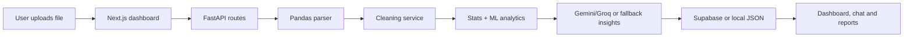

# NexusData AI

Full-stack analytics platform for turning CSV, Excel and JSON files into cleaned datasets, executive insights, dashboards, chat-based exploration and exportable reports.

This project is built as a portfolio-grade example for data analysis, automation and product building: it combines a FastAPI data pipeline, AI-assisted insight generation, automated cleaning, ML heuristics, a polished Next.js dashboard and deployment-ready configuration.

## Why It Stands Out

- End-to-end data workflow: upload, parse, clean, profile, analyze, visualize, chat and export.
- AI provider strategy: Gemini/Groq support with a rule-based fallback so the app remains useful without external keys.
- Analyst UX: dashboard sections for data quality, raw vs cleaned comparison, chart recommendations, advanced analytics and reports.
- Automation mindset: generated PDF/PPTX reports, suggested questions, persisted analysis history and portfolio metrics.
- Production shape: typed frontend, modular backend services, CORS setup, Vercel/Render/Railway config and local JSON fallback storage.

## Tech Stack

| Layer | Tools |
| --- | --- |
| Frontend | Next.js 16, React 19, TypeScript, Tailwind CSS, Recharts, Framer Motion |
| Backend | FastAPI, Pandas, NumPy, Scikit-learn, Pydantic |
| AI | Gemini, Groq, deterministic rule-based fallback |
| Persistence | Supabase when configured, local JSON storage fallback |
| Reports | ReportLab PDF, python-pptx PowerPoint |
| Deployment | Vercel frontend config, Render/Railway backend config |

## Core Features

- Upload CSV, XLSX, XLS or JSON datasets.
- Clean messy data and generate before/after quality scores.
- Profile numeric, categorical and datetime columns.
- Detect missing values, correlations and anomalies.
- Generate automatic chart payloads for bar, line, area, scatter, histogram, boxplot, heatmap and pie views.
- Produce executive insight narratives and recommended actions.
- Run optional churn, RFM, regression and clustering signals when the schema supports them.
- Ask natural-language questions about a stored dataset.
- Export analysis as PDF or PowerPoint.
- View real portfolio metrics at `/intelligence`.

## Local Setup

### Backend

```powershell
cd backend
python -m venv venv
.\venv\Scripts\Activate.ps1
pip install -r requirements.txt
copy .env.example .env
python main.py
```

Backend: `http://127.0.0.1:8000`

### Frontend

```powershell
cd frontend
npm install
npm run dev
```

Frontend: `http://localhost:3000`

## Environment Variables

Backend:

```env
GEMINI_API_KEY=
GROQ_API_KEY=
SUPABASE_URL=
SUPABASE_KEY=
APP_ENV=development
```

Frontend:

```env
NEXT_PUBLIC_API_URL=http://127.0.0.1:8000
```

AI keys and Supabase are optional for local demos. Without AI keys, the backend still generates deterministic analyst-style insights.

## API Highlights

| Endpoint | Method | Purpose |
| --- | --- | --- |
| `/api/health` | GET | Service health and degraded/healthy status |
| `/api/providers` | GET | Available AI providers |
| `/api/portfolio/metrics` | GET | Real project metrics for the portfolio dashboard |
| `/api/datasets/` | GET | Analysis history |
| `/api/datasets/upload` | POST | Upload and analyze a dataset |
| `/api/datasets/{id}` | GET | Analysis detail |
| `/api/datasets/{id}/chat` | POST | Ask a question about a dataset |
| `/api/datasets/{id}/export/pdf` | GET | Export PDF |
| `/api/datasets/{id}/export/pptx` | GET | Export PowerPoint |

## Suggested Demo Flow

1. Start backend and frontend.
2. Upload `example_dataset.csv`.
3. Open the generated dashboard.
4. Show quality score changes, raw vs cleaned preview and chart recommendations.
5. Ask a dataset question in the chat panel.
6. Export a PDF or PowerPoint report.
7. Open `/intelligence` to show live portfolio metrics.

## Architecture



## CV Positioning

This project demonstrates that I can build analyst tools from zero: data ingestion, cleaning logic, statistical profiling, AI integration, UI design, report automation, API design and deploy-ready packaging.

Suggested CV bullet:

> Built NexusData AI, a full-stack analytics automation platform that transforms raw CSV/Excel/JSON datasets into cleaned data, quality scores, AI insights, dashboards, dataset chat and PDF/PPTX reports using FastAPI, Pandas, Scikit-learn, Next.js and TypeScript.

## Verification

```powershell
cd frontend
npm run build
```

```powershell
cd backend
python -m pytest
```

The repository also includes PowerShell scripts for manual backend upload testing.
